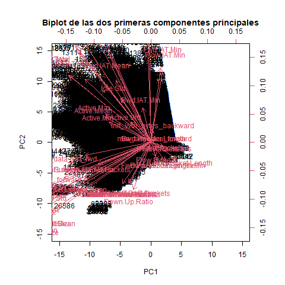

```{r setup, include=FALSE}
knitr::opts_chunk$set(echo = TRUE)
```

\
**Introducción**

En este trabajo se va a realizar un análisis de un dataset que contiene información sobre conexiones de red. El objetivo es identificar si una conexión es benigna o maligna, es decir, si se trata de un keylogger o no. Para ello, se utilizarán distintos algoritmos de machine learning y se compararán los resultados obtenidos. El cuaderno se dividirá en las siguientes secciones:

1. [Exploración del dataset y agrupación de variables](#agrupacion)
2. [Preprocesamiento de los datos](#preprocesamiento)
3. [Sampleo de los datos](#sampleo)
4. [Análisis PCA](#pca)
5. [Regresión logística](#regresion-logistica)
6. [Bagging](#bagging)
7. [Red Neuronal](#red-neuronal)
8. [Análisis de resultados](#analisis-resultados)

Antes de empezar con el trabajo tenemos que cargar las librerías necesarias, configurar el directorio de trabajo y seleccionar una semilla aleatoria para todo el cuaderno.
```{r configuracion inicial, results = "hide", message = FALSE, warning = FALSE}
# Seleccioamos el directorio actual como directorio de trabajo
# Si estamos compilando no lo hacemos para que no de error la compilación
if (interactive()) {
  setwd(dirname(rstudioapi::getActiveDocumentContext()$path))
}

# Cargamos las librerías necesarias
library(summarytools)
library(randomForest)
library(keras)
library(magrittr)
library(doParallel)
library(MLmetrics)
library(reticulate)

# Seleccionamos la semilla aleatoria para todo el cuaderno
set.seed(12345)
```


Para que el cuaderno se pueda compilar rápidamente, vamos a cargar previamente los resultados que nos hagan falta. De esta forma, podremos dejar celdas sin ejecutar pero mostrando el código. 

\

# Exploración del dataset y agrupación de variables. {#agrupacion}
En esta sección analizaremos las variables del dataset y las agruparemos por temáticas. Se describirá el significado de cada grupo de características identificado. Toda la información acerca de las variables se ha extraído del documento [`ReadMe.txt`](ReadMe.txt) del repositorio CICFlowMeter. Dicho documento se encuentra disponible en [CICFlowMeter/ReadMe.txt](https://github.com/ahlashkari/CICFlowMeter/blob/master/ReadMe.txt).

```{r string dataset original}
# Leemos el dataset
mydf <- read.csv("Keylogger_Detection.csv", header = TRUE, sep = ",")

# Mostramos las variables del dataset
str(mydf)
```

Los grupos en los que pueden dividirse las variables del dataset según su temática son los siguientes:


1. **Características del flujo**. Las variables pertenecientes a este grupo son Flow.ID, Source.IP, Source.Port, Destination.IP, Destination.Port, Protocol, Timestamp y Class. Estas variables son características que sirven principalmente para identificar de forma general al flujo, sin entrar en detalles acerca de sus paquetes.


2. **Características de los paquetes del flujo**. Como su nombre indica, este grupo está compuesto por características relacionadas con los paquetes del flujo, como su duración, su tamaño, el numero de bytes y paquetes por segundo (.s, per second), además de la proporción entre la cantidad de datos transmitidos en dirección backward y la cantidad transmitida en dirección forward. Según si se tiene en cuenta las características forward y backward o no, pueden tenerse tres subgrupos:

   1. **Generales**. Son variables de los paquetes del flujo en general, sin tener en cuenta las características forward o backward. En este subgrupo se incluyen las variables Flow.Duration, Flow.Bytes.s, Flow.Packets.s y Down.Up.Ratio. También existen otras medidas estadísticas de este subgrupo, que son Min.Packet.Length, Max.Packet.Length, Packet.Length.Mean, Packet.Length.Std, Packet.Length.Variance y Average.Packet.Size.
   2. **Forward**. Se corresponden con la característica forward. Las variables correspondientes son Total.Fwd.Packets, Total.Length.of.Fwd.Packets y Fwd.Packets.s. Además, se tienen otras variables de carácter estadístico, que son Avg.Fwd.Segment.Size, Fwd.Packet.Length.Max, Fwd.Packet.Length.Min, Fwd.Packet.Length.Mean, Fwd.Packet.Length.Std y min_seg_size_forward.
   3. **Backward**. Se corresponden con la característica backward. Las variables correspondientes son Total.Backward.Packets, Total.Length.of.Bwd.Packets y Bwd.Packets.s. Se tienen también las siguientes medidas estadísticas: Avg.Bwd.Segment.Size, Bwd.Packet.Length.Max, Bwd.Packet.Length.Min, Bwd.Packet.Length.Mean y Bwd.Packet.Length.Std.
  
    
3. **Características sobre el tiempo transcurrido entre un paquete y el siguiente**. Estas variables son las que contienen IAT (inter-arrival time), y como su nombre indica, son variables, casi todas estadísticas, acerca del tiempo transcurrido entre dos paquetes consecutivos. Aquí podemos distinguir tres grupos:

   1. **Generales**. Son medidas estadísticas sobre el IAT del flujo en general, sin distinguir entre forward y backward. Sus variables son Flow.IAT.Mean, Flow.IAT.Std, Flow.IAT.Max y Flow.IAT.Min.
   2. **Forward**. Medidas sobre el IAT con característica forward. Sus variables son Fwd.IAT.Total, Fwd.IAT.Mean, Fwd.IAT.Std, Fwd.IAT.Max y Fwd.IAT.Min.
   3. **Backward**. Medidas sobre el IAT con característica backward. Sus variables son Bwd.IAT.Total, Bwd.IAT.Mean, Bwd.IAT.Std, Bwd.IAT.Max y Bwd.IAT.Min.
  
  
4. **Características sobre los flags**. Este grupo contiene información sobre el número de paquetes del flujo que contienen distintos flags. Existen tanto variables generales como variables que tienen en cuenta si la dirección es forward o backward.

   1. **Generales**. Las variables son FIN.Flag.Count, SYN.Flag.Count, RST.Flag.Count, PSH.Flag.Count, ACK.Flag.Count, URG.Flag.Count, CWE.Flag.Count y ECE.Flag.Count. 
   2. **Forward**. Son Fwd.PSH.Flags y Fwd.URG.Flags.
   3. **Backward**. Son Bwd.PSH.Flags y Bwd.URG.Flags.


5. **Características sobre la longitud de la cabecera**. Representan el total de bytes usados por las cabeceras, diferenciando entre direcciones forward y backward. Se dividen por tanto en:

   1. **Forward**. Su variable es Fwd.Header.Length.
   2. **Backward**. Su variable es Bwd.Header.Length.


6. **Características sobre los bulk rates de los paquetes**. Estas variables describen el número de paquetes que son transmitidos de forma masiva (bulk). Se distingue entre características forward y backward:

   1. **Forward**. Son las variables Fwd.Avg.Bytes.Bulk, Fwd.Avg.Packets.Bulk y Fwd.Avg.Bulk.Rate.
   2. **Backward**. Son las variables Bwd.Avg.Bytes.Bulk, Bwd.Avg.Packets.Bulk y Bwd.Avg.Bulk.Rate.
  
  
7. **Características sobre los paquetes de los subflujos o flujos secundarios**. Como su nombre indica, presentan información sobre los paquetes de este tipo de flujo. Pueden dividirse según la dirección del flujo.

   1. **Forward**. Son Subflow.Fwd.Packets y Subflow.Fwd.Bytes.
   2. **Backward**. Son Subflow.Bwd.Packets y Subflow.Bwd.Bytes.


8. **Características sobre la ventana inicial del flujo**. Son el número de total de bytes transferidos, tanto en la dirección forward como en la backward, en la ventana inicial del flujo. Tenemos de nuevo la siguiente división:

   1. **Forward**. Su única variable es Init_Win_bytes_forward.
   2.  **Backward**. Su única variable es Init_Win_bytes_backward.
  
  
9. **Características sobre la carga útil**. Tratan sobre el número de paquetes que contienen al menos un 1 byte de carga útil. Solamente existe para la dirección forward. Su única variable es act_data_pkt_fwd.


10. **Características estadísticas sobre la actividad e inactividad del flujo**. Son medidas de carácter estadístico sobre el tiempo que un flujo estuvo enviando o recibiendo datos (active) antes de volverse inactivo, y del caso contrario, sobre el tiempo que estuvo inactivo (idle) antes de volverse activo. Son las variables Active.Mean, Active.Std, Active.Max, Active.Min, Idle.Mean, Idle.Std, Idle.Max y Idle.Min.


Puede observarse que la distinción entre las características forward y backward aparecen en gran cantidad de las variables del dataset. Lo que dichas características representan son la dirección en la que los datos del flujo son dirigidos, siendo forward cuando van del dispositivo de origen al de destino y backward cuando van del dispositivo de destino al de origen. Puede considerarse esta distinción relevante a priori para nuestro análisis, ya que es posible que cada dirección presente un patrón distinto en el comportamiento de sus variables, lo que puede darnos información valiosa sobre qué factores influyen mayormente en el tipo de conexión que se quiere predecir.

\

# Preprocesamiento de los datos. {#preprocesamiento}
Antes de empezar con los análisis se deben preprocesar los datos. En esta sección se explicarán los preprocesamientos realizados y sus razonamientos.

Lo primero de todo es visualizar el dataset completo con todas sus variables:
```{r resumen dataset original}
# Mostramos el dataset completo
print(dfSummary(mydf, plain.ascii = FALSE), method = "render")
```

Ahora vamos a eliminar del dataset las variables que no aportan información relevante para el análisis.
```{r eliminacion variables}
# Guardamos una copia del dataset original para comparar posteriormente
mydf.original <- mydf

# Seleccionamos los predictores que no aportan información relevante
vars.to.remove <- c("X", "Flow.ID", "Timestamp", "Source.IP", "Destination.IP", "Source.Port", "Destination.Port", "Fwd.Header.Length.1")

# Eliminamos los predictores seleccionados
mydf <- mydf[, !names(mydf) %in% vars.to.remove]
```

La explicación de por qué hemos eliminado cada variable es la siguiente:

- "X" es un índice que no aporta información relevante.
- "Flow.ID" es un identificador del flujo, por lo que no es una característica como tal.
- "Timestamp" es un instante temporal, no es una característica del flujo y por tanto no aporta información relevante.
- "Source.IP" y "Destination.IP" son identificadores de los dispositivos fuente y destino, respectivamente, y no son características del flujo. No aportan información al análisis. Además, no pueden interpretarse como variables ni numéricas ni categóricas (ya que tendrían demasiados valores únicos), y no se puede realizar un análisis siendo variables de tipo character.
- "Source.Port" y "Destination.Port" son los puertos de origen y destino, respectivamente, y no son características del flujo. No aportan información al análisis. No pueden interpretarse como variables categóricas (ya que tendrían demasiados valores únicos), y no dan información real de tipo numérico.
- "Fwd.Header.Length.1" es una variable repetida, ya que es igual a "Fwd.Header.Length".

<span id="analisis-cwe"> Al analizar las variables vemos que hay una con una situación particular. Se trata de "CWE.Flag.Count", que tiene valores "0", "0.0", "" y "SCAREWARE". Además, estos valores atípicos no son pocos, suponen el 6% del total, más que los valores "1" de otros Flags como "FIN.Flag.Count", donde solo el 1.7% son valores 1. Esto puede deberse a que, por un error, los valores atípicos deberían ser 1. Si fuera un error de tipografía que pasará algunos valores 0 a 0.0 no habría tantos casos. Además, a esto se le suma que este Flag indica "Common Weakness Enumeration", que es un estándar utilizado para categorizar y describir vulnerabilidades en sistemas de software, lo que puede ser relevante para detectar keyloggers. 

Para determinar la importancia de esta variable, antes de decidir cómo trabajar con ella, vamos a realizar una tabla de contingencia con la variable "Class" para ver cómo se distribuyen los valores de "CWE.Flag.Count" en función de si la conexión es benigna o maligna.
```{r tabla contingencia}
# Creamos una tabla de contingencia
tabla.contingencia <- addmargins(table(mydf$CWE.Flag.Count, mydf$Class))
print(tabla.contingencia)
```

Se puede ver cómo todos los valores que no son "0" en "CWE.Flag.Count" son "Keylogger". Esto quiere decir que la variable "CWE.Flag.Count" es un predictor muy importante para el análisis que queremos realizar del dataset. Además, esto puede indicarnos que los valores que no son "0" pueden ser un tipo de vulnerabilidad del sistema. Por ello, para poder trabajar de forma más estándar con esta variable, vamos a convertir los valores anómalos a "1", de forma que solo tenga valores "0" y "1".
```{r conversion valores anómalos}
# Convertimos los valores anómalos a 1
mydf$CWE.Flag.Count <- ifelse(mydf$CWE.Flag.Count != "0", "1", mydf$CWE.Flag.Count)
```

Ahora vamos a comprobar los valores nulos del dataset y ver cómo los tratamos. Empecemos viendo la cantidad de filas con nulos.
```{r valores nulos}
# Buscamos las filas con valores nulos
na.coordinates <- which(is.na(mydf), arr.ind = TRUE)

# Vemos las distintas filas en las que se encuentran
na.rows <- unique(na.coordinates[, "row"])

# Calculamos la proporción respecto al número total de filas
na.prows <- length(na.rows) / nrow(mydf) * 100
paste("El porcentaje de filas con nulos es: ", na.prows, "%", sep = "")
```

Vemos que el dataset contiene muy poca cantidad de valores nulos. Por lo tanto, eliminamos las filas con valores NA.
```{r eliminacion nulos, eval = FALSE}
# Eliminamos las filas con valores nulos
mydf <- na.omit(mydf)
```

Ahora, eliminamos las filas duplicadas.
```{r eliminacion duplicados, eval = FALSE}
# Eliminamos las filas duplicadas
mydf <- mydf[!duplicated(mydf), ]
```

Vamos a eliminar las columnas con desviación estándar cero. Para ello, pasaremos a numérico todas las variables que no sean claramente caracteres.
```{r eliminar constantes, eval = FALSE}
# Pasamos a numérico las variables que les corresponde
mydf$Packet.Length.Std <- as.numeric(mydf$Packet.Length.Std)
mydf$CWE.Flag.Count <- as.numeric(mydf$CWE.Flag.Count)

# Seleccionamos las columnas numéricas
num_cols <- which(sapply(mydf, is.numeric))

# Obtenemos las columnas con desviaciones estándar nulas
constant_cols <- which(sapply(mydf[, num_cols], sd) == 0)

# Eliminamos las columnas con valores constantes
mydf <- mydf[, -constant_cols]
```

Guardamos el dataset procesado.
```{r crear dataset procesado, eval = FALSE}
# Guardamos el dataset procesado
write.csv(mydf, "Keylogger_Detection_processed.csv", row.names = FALSE)
```

Para ver que el dataset procesado sirve para trabajar, vamos a comparar el porcentaje de valores positivos y negativos en los dos datasets.
```{r comprobar proporciones original-procesado}
# Cargamos el dataset procesado
mydf <- read.csv("Keylogger_Detection_processed.csv", header = TRUE, sep = ",")

# Pasamos las variables correspondientes a factor
mydf$Protocol <- as.factor(mydf$Protocol)
mydf$Fwd.PSH.Flags <- as.factor(mydf$Fwd.PSH.Flags)
mydf$FIN.Flag.Count <- as.factor(mydf$FIN.Flag.Count)
mydf$SYN.Flag.Count <- as.factor(mydf$SYN.Flag.Count)
mydf$PSH.Flag.Count <- as.factor(mydf$PSH.Flag.Count)
mydf$ACK.Flag.Count <- as.factor(mydf$ACK.Flag.Count)
mydf$URG.Flag.Count <- as.factor(mydf$URG.Flag.Count)
mydf$CWE.Flag.Count <- as.factor(mydf$CWE.Flag.Count)
mydf$Class <- as.factor(mydf$Class)

# Porcentaje de valores positivos y negativos en el dataset original
table(mydf.original$Class) / nrow(mydf.original) * 100

# Porcentaje de valores positivos y negativos en el dataset procesado
table(mydf$Class) / nrow(mydf) * 100
```

Vemos que la proporción de casos positivos y negativos no cambia. Por lo tanto, el dataset procesado sirve para trabajar. 

\

# Sampleo de los datos. {#sampleo}
Para poder trabajar con holgura a lo largo de la práctica, vamos a coger una muestra del dataset original del 20%. De esta forma, los tiempos de ejecución serán menores y podremos trabajar más rápido.

```{r crear sampled, eval = FALSE}
# Sampleamos el dataset
mydf.sample <- mydf[sample(nrow(mydf), nrow(mydf) * 0.2), ]

# Guardamos el dataset sampleado
write.csv(mydf.sample, "sampled.csv", row.names = FALSE)
```

Una vez tenemos el dataset sampleado, vamos a comprobar que la proporción de casos positivos y negativos no ha cambiado.
```{r comprobar proporciones original-sampleado}
mydf.sample <- read.csv("sampled.csv", header = TRUE, sep = ",")

# Porcentaje de valores positivos y negativos en el dataset sampleado
table(mydf.sample$Class) / nrow(mydf.sample) * 100

# Porcentaje de valores positivos y negativos en el dataset original
table(mydf.original$Class) / nrow(mydf.original) * 100
```

Vemos que las proporciones de positivos y negativos en ambos datasets son prácticamente iguales, por lo que podemos comenzar nuestro análisis con este último dataset sampleado.

\

# Análisis PCA. {#pca}

\

## Carga del dataset sampleado

Primero de todo hay que volver a cargar el dataset sampleado. Además, se deben volver a pasar a factor las variables que lo requieran.
```{r cargar dataset sampleado}
# Leemos el dataset preprocesado
mydf <- read.csv("sampled.csv", header = TRUE, sep = ",")

# Pasamos las variables correspondientes a factor
mydf$Protocol <- as.factor(mydf$Protocol)
mydf$Fwd.PSH.Flags <- as.factor(mydf$Fwd.PSH.Flags)
mydf$FIN.Flag.Count <- as.factor(mydf$FIN.Flag.Count)
mydf$SYN.Flag.Count <- as.factor(mydf$SYN.Flag.Count)
mydf$PSH.Flag.Count <- as.factor(mydf$PSH.Flag.Count)
mydf$ACK.Flag.Count <- as.factor(mydf$ACK.Flag.Count)
mydf$URG.Flag.Count <- as.factor(mydf$URG.Flag.Count)
mydf$CWE.Flag.Count <- as.factor(mydf$CWE.Flag.Count)
mydf$Class <- as.factor(mydf$Class)

# Nos aseguramos de que la clase positiva sea "Keylogger" asignando como clase de referencia a "Benign"
mydf$Class <- relevel(mydf$Class, ref = "Benign")
```

\

## Análisis del PCA

Vamos a realizar el PCA con el conjunto preprocesado. Primero, seleccionamos las columnas numéricas.
```{r seleccionar columnas numericas}
# Seleccionamos las columnas numéricas
mydf.numeric <- mydf[, sapply(mydf, is.numeric)]
```

Una vez tenemos las columnas numéricas seleccionadas, realizamos el PCA. No hace falta estandarizar las variables previamente ya que el PCA lo hace por nosotros con el parámetro `scale = TRUE`.
```{r realizar PCA}
# Realizamos PCA
pr.out <- prcomp(mydf.numeric, scale = TRUE)
```

Vamos a realizar un análisis del PCA para ver qué información nos aporta. Para ello, primero vamos a ver la varianza acumulada, para determinar cuáles son las componentes principales más importantes.
```{r resumen PCA}
# Vemos la varianza explicada
summary(pr.out)

# Realizamos un gráfico de la varianza acumulada
pr.out.cumvar <- cumsum(pr.out$sdev^2 / sum(pr.out$sdev^2))
plot(
  pr.out.cumvar,
  xlab = "Componente principal",
  ylab = "Varianza acumulada",
  main = "Varianza acumulada explicada por las componentes principales",
  type = "b"
)
abline(h = 0.8, col = "red")

# Seleccionamos las componentes principales que expliquen al menos el 80% de la varianza
ncomp <- which(pr.out.cumvar > 0.8)[1]
ncomp
```

Vemos que necesitamos las 11 primeras componentes principales para explicar el 80% de la varianza. Solo con las 2 primeras componentes principales explicamos tan solo el 36.26% de la varianza, una cifra muy baja. Por tanto, necesitamos muchas componentes principales para explicar la varianza de los datos.

Vamos a realizar un biplot para ver cómo se relacionan las variables con las dos primeras componentes principales.
```{r biplot, eval = FALSE}
# Realizamos un biplot solo con los vectores, no con los datos
png("biplot.png")
biplot(
  pr.out,
  scale = 0, xlim = c(-15, 15), ylim = c(-15, 15),
  xlab = "PC1", ylab = "PC2",
  main = "Biplot de las dos primeras componentes principales"
)
dev.off()
```



Se puede ver en la imagen del biplot que tenemos demasiados predictores y demasiados valores; no se puede sacar nada en claro. Además, como PC1 y PC2 explican solo el 36.26% de la varianza, el biplot tampoco sería representativo.

Por todo esto, podemos ver que la elaboración de un modelo de clasificación que identifique conexiones de keystrokes va a ser un problema complicado. Tenemos muchos predictores y ver las relaciones entre ellos no va a ser una tarea sencilla. Si intentásemos reducir la dimensionalidad del problema con PCA, como mucho podríamos reducir a 11 dimensiones, lo cual sigue siendo una gran cantidad de variables.

\

# Regresión logística. {#regresion-logistica}
Vamos a intentar predecir si una conexión es benigna o maligna mediante un modelo de regresión logística. Realizaremos unas predicciones con el resultado del modelo y veremos cómo funciona para el dataset. No usaremos conjunto de prueba ni de test, ya que simplemente queremos ver cómo de eficaz es con nuestro conjunto de datos.

```{r regresion logistica}
# Creamos el modelo de regresión logística
logr <- glm(Class ~ ., data = mydf, family = binomial)

# Vemos un resumen de logr
summary(logr)

# Vemos los coeficientes que han generado aliasing en el modelo
alias.info <- alias(logr)
alias.matrix <- as.matrix(alias.info$Complete)
alias.matrix <- abs(alias.matrix[, apply(alias.matrix, 2, sd) != 0])
alias.matrix <- round(alias.matrix)
alias.matrix
```

Vemos que hay variables que han generado aliasing en el modelo, lo que significa que están perfectamente correlacionadas con otras variables (variables de filas con variables de columnas). El modelo de regesión logística directamente no tendrá en cuenta estas variables. 

Una vez tenemos el modelo creado, realizamos unas predicciones. Con estas predicciones se harán unas tablas de confusión para ver cómo se comporta el modelo.
```{r predicciones regresion logistica}
# Realizamos las predicciones
logr.probs <- predict(logr, type = "response")
logr.pred <- ifelse(logr.probs > 0.5, "Benign", "Keylogger")
logr.table <- table(logr.pred, mydf$Class)
dimnames(logr.table) <- list(
  Predict = c("Benign", "Keylogger"),
  Real = c("Benign", "Keylogger")
)

# Realizamos las tablas de confusión
addmargins(round(prop.table(logr.table) * 100, 2))

# Hacemos una suma por columnas para ver la precisión
addmargins(round(prop.table(logr.table, 2) * 100, 1), 1)

# Hacemos una suma por filas para ver la sensibilidad
addmargins(round(prop.table(logr.table, 1) * 100, 1), 2)
```

Analizando la tabla de confusión vemos que el modelo no es capaz de predecir correctamente si una conexión es benigna o maligna.

- De las conexiones que son benignas, el modelo solo es capaz de predecir correctamente el 2.9%. 
- De las conexiones que son keylogger, el modelo predice correctamente el 79.0%.
- De las conexiones que se han predicho como benignas, solo el 16.4% eran realmente benignas, dejando una tasa de falso positivo del 83.6%.
- De las conexiones que se han predicho como keylogger, solo el 36.3% eran realmente keylogger, dejando una tasa de falso negativo del 63.7%.
  
Con este análisis podemos concluir que el modelo es nefasto prediciendo conexiones benignas. Prediciendo conexiones keylogger es mejor, categorizando bien el 79% de las conexiones malignas del dataset. Sin embargo, la sensibilidad del modelo es muy mala, como mucho del 36.3% en los keyloggers, por lo que el modelo falla mucho a la hora de categorizar. Por todo esto, no es viable usar un modelo de regresión para este problema.

\

# Validación cruzada. {#validacion-cruzada}
A la hora de crear un modelo de machine learning, es importante seleccionar correctamente los hiperparámetros del mismo. Para probar combinaciones de diferentes hiperparámetros, crearemos vectores de hiperparámetros $v_i$, de forma que cada vector $v_i$ contenga un valor para cada uno de los $m$ hiperparámetros que queremos probar. Para cada vector de hiperparámetros $v_i$ realizaremos una validación cruzada, de forma que podamos obtener un resultado de precisión y error para cada combinación de hiperparámetros. Luego se usará la regla del One-Standard-Error para seleccionar el hiperparámetro más simple que tenga un rendimiento aceptable.

Para realizar la validación cruzada se hará lo siguiente:

1. Se dividirá el conjunto de entrenamiento en 5 pliegues, de forma que cada pliegue contenga el 20% de los datos de entrenamiento.
2. Se entrenará el modelo con 4 pliegues y se validará con el pliegue restante. Se repetirá este proceso 5 veces, de forma que cada pliegue sea el de validación una vez.
3. Se calculará la media de los resultados obtenidos en cada pliegue para obtener una estimación más precisa del rendimiento del modelo.
4. Se calculará el error estándar de la media con el fin de obtener una estimación de la variabilidad de la media.
5. Se seleccionará el hiperparámetro más simple cuyo valor medio más error estándar esté dentro del margen del valor máximo de precisión menos su error estándar. Por ejemplo, si el valor máximo es de $0.8 \pm 0.1$, se podrán seleccionar valores como $0.6 \pm 0.2$, ya que $0.6 + 0.2 > 0.8 - 0.1$.

Para comprobar la eficacia de un conjunto de hiperparámetros hay que utilizar una métrica de evaluación. En nuestro caso, utilizaremos el F1-Score. Esta métrica es una media armónica de la precisión y la sensibilidad, y se calcula como $2 \times \frac{Precision \times Sensitivity}{Precision + Sensitivity}$. El F1-Score es una métrica más adecuada para problemas de clasificación binaria desbalanceada, como es nuestro caso, debido al balance que hace. También se calculará el Accuracy, que aunque sea una métrica menos fiable es más fácil de interpretar.

Después de realizar la validación con un vector $v_i$, se guardará una media del F1-Score (y el Accuracy) y un error estándar de esta media, de forma que para cada conjunto de hiperparámetros $v_i$ se obtendrá un F1-Score medio y un error estándar asociado. Luego, se escogerá el vector de hiperparámetros más sencillos que contenga un F1-Score medio más error estándar dentro del margen del valor máximo de F1-Score menos su error estándar. Es decir, si tenemos un máximo de F1-Score de $0.8 \pm 0.1$, podremos seleccionar valores como $0.6 \pm 0.2$, ya que $0.6 + 0.2 > 0.8 - 0.1$.

\

# Bagging. {#bagging}

\

## Explicación del modelo
En esta sección vamos a realizar una clasificación mediante un algoritmo de Bagging, concretamente un algoritmo Random Forest. Vamos a explicar cómo funciona el modelo.

El método de Bagging (Bootstrap Aggregating) es un procedimiento utilizado para reducir la varianza de un método de aprendizaje estadístico, siendo particularmente útil en el contexto de árboles de decisión, aunque puede usarse en otros métodos. Bagging implica crear múltiples copias del conjunto de datos de entrenamiento original usando el método Bootstrap, ajustar un árbol de decisión separado a cada copia, y luego combinar todos los árboles para crear un único modelo predictivo. En el caso de la clasificación, que es el que nos interesa, la predicción final se realiza por votación de los árboles individuales.

El Random Forest es un caso particular de Bagging. El modelo de Random Forest introduce una modificación para decorrelacionar los árboles, reduciendo así la varianza cuando se promedian estos árboles. Al igual que en Bagging, Random Forest construye múltiples árboles de decisión sobre muestras de entrenamiento obtenidas mediante Bootstrap. Sin embargo, introduce un paso adicional en la construcción de cada árbol que marca la principal diferencia con el método de Bagging: cuando se construye un árbol de decisión este utiliza solo $m$ predictores, escogidos aleatoriamente de entre los $p$ predictores disponibles.

Los hiperparámetros que utiliza el modelo Random Forest son los siguientes:

- $mtry$: Número de predictores que se seleccionan aleatoriamente en cada nodo para elegir la división óptima. El valor de $mtry$ que suele usarse en el caso de la clasificación es $\sqrt{p}$, siendo $p$ el número total de predictores. Por lo tanto, probaremos con $mtry = \sqrt{p} - 1$, $mtry = \sqrt{p}$ y $mtry = \sqrt{p} + 1$.
- $ntree$: Número de árboles que se construyen. A mayor cantidad de árboles se reduce la varianza del modelo, pero aumenta el tiempo de computación. Probaremos con $ntree = 300, 500, 700$.
- $nodesize$: Número mínimo de elementos que puede tener un nodo. A menor tamaño, más complejos se harán los árboles. Probaremos con $nodesize = 10, 50, 100$.

\

## Preparación de los datos de entrenamiento, prueba y los folds

Lo primero de todo es escalar los datos para que tengan media 0 y varianza 1. Esto es necesario para que el modelo funcione correctamente.
```{r escalar datos numericos}
# Escogemos los datos numéricos
mydf.numeric <- mydf[, sapply(mydf, is.numeric)]

# Escalamos los datos numéricos
mydf.numeric.scaled <- scale(mydf.numeric)

# Introducimos los datos escalados en el dataset
mydf[, sapply(mydf, is.numeric)] <- mydf.numeric.scaled
```

Vamos a dividir el conjunto de datos en un conjunto de entrenamiento y un conjunto de prueba.

```{r dividir train y test}
# Dependiendo de las celdas que se hayan ejecutado la selección de números aleatorios puede cambiar
# así que volvemos a fijar la semilla
set.seed(12345)

# Dividimos el dataset en train y test
train_index <- sample(1:nrow(mydf), nrow(mydf) * 0.8)
train <- mydf[train_index, ]
test <- mydf[-train_index, ]
```

Ahora dividimos el conjunto de train en 5 pliegues para realizar la validación cruzada.
```{r dividir folds}
# Definimos el número de pliegues
n <- 5

# Generamos un vector de igual longitud que el numero de filas de train, asociando cada valor a un pliegue
folds_indexes <- sample(rep(1:n, length.out = nrow(train)))
```

De esta forma ya tenemos cinco pliegues preparados para realizar validacion cruzada.

\

## Proceso de validación cruzada
Vamos a realizar la validación cruzada con el bagging. Para realizar la validación cruzada vamos a utilizar el paquete `doParallel`. Esta librería nos permite realizar cálculos en paralelo, lo que nos permitirá reducir el tiempo de cálculo. 

Definimos los hiperparámetros.
```{r definir hiperparametros bagging}
# Definimos los valores de mtry, ntree y nodesize que vamos a probar
values.mtry.op <- as.integer(sqrt(ncol(mydf))) # Valor "óptimo" de mtry
values.mtry <- c(values.mtry.op - 1, values.mtry.op, values.mtry.op + 1)
values.ntree <- c(300, 500, 700)
values.nsizes <- c(10, 50, 100)

# Creamos una matriz con todas las combinaciones posibles de los valores de mtry, ntree y nodesize
v <- expand.grid(values.mtry, values.ntree, values.nsizes)
colnames(v) <- c("mtry", "ntree", "nodesize")
```

Realizamos la validación cruzada con `doParallel`.
```{r VD bagging, eval = FALSE}
# Creamos un cluster para realizar los cálculos en paralelo
cl <- makeCluster(detectCores() - 1) # Dejamos un núcleo libre

# Registramos el cluster
registerDoParallel(cl)

# Creamos una variable de tiempo para ver cuánto tarda en ejecutarse
inicio <- Sys.time()

# Creamos una variable para guardar el F1-Score
f1score.folds <- rep(0, length(folds))
accuracy.folds <- rep(0, length(folds))

# Realizamos la validación cruzada con todos los pliegues e hiperparámetros
crossvalidation.results <- foreach(i = 1:nrow(v), .combine = rbind, .packages = c("randomForest", "MLmetrics")) %dopar% {
  for (k in seq(1:length(folds))) {
    # Juntamos todos los folds menos el k
    data <- do.call(rbind, folds[-k])

    # Creamos el modelo de bagging
    bag <- randomForest(Class ~ .,
      data = data,
      mtry = v[i, 1], ntree = v[i, 2], nodesize = v[i, 3]
    )

    # Predecimos con el pliegue que hemos dejado fuera del entrenamiento
    y.pred <- predict(bag, newdata = folds[[k]])

    # Guardamos los valores reales
    y.true <- folds[[k]]$Class

    # Guardamos el F1-Score obtenido comparando las predicciones y los datos reales del pliegue k
    f1score.folds[k] <- F1_Score(y_pred = y.pred, y_true = y.true, positive = "Keylogger")
    accuracy.folds[k] <- Accuracy(y_pred = y.pred, y_true = y.true)
  }

  # Hacemos la media de los F1-Score de todos los pliegues
  mean.f1score <- mean(f1score.folds)
  se.f1score <- sd(f1score.folds) / sqrt(length(folds))

  # Hacemos una media del Accuracy de todos los pliegues
  mean.accuracy <- mean(accuracy.folds)
  se.accuracy <- sd(accuracy.folds) / sqrt(length(folds))

  # Devolvemos los resultados
  c(mean.f1score, se.f1score, mean.accuracy, se.accuracy)
}

# Guardamos el tiempo final
final <- Sys.time()

# Calculamos el tiempo de entrenamiento
train.time <- as.numeric(difftime(final, inicio, units = "secs"))
train.time <- sprintf("%02.0f:%02.0f:%02.0f", train.time %/% 3600, (train.time %% 3600) %/% 60, train.time %% 60)

# Guaradmos el tiempo de entrenamiento en un DataFrame
train.time.df <- data.frame(time_bagging = train.time)
train.time.df$time_bagging_sec <- as.numeric(difftime(final, inicio, units = "secs"))

# Guardamos el tiempo de entrenamiento en un archivo
write.csv(train.time.df, "train_time_bagging.csv", row.names = FALSE)

# Creamos un DataFrame con los resultados de la validación cruzada
crossvalidation.results <- as.data.frame(crossvalidation.results)
colnames(crossvalidation.results) <- c("mean_f1score", "se_f1score", "mean_accuracy", "se_accuracy")
crossvalidation.results <- cbind(v, crossvalidation.results)

# Guardamos los resultados de la validación cruzada en un archivo
write.csv(crossvalidation.results, "crossvalidation_bagging.csv", row.names = FALSE)
```

Una vez hemos realizado la validación cruzda, vamos a representar los resultados y seleccionar los hiperparámetros que han obtenido el mejor F1-Score.
```{r resultados VD}
# Cargamos los resultados de la validación cruzada
crossvalidation.results <- read.table("crossvalidation_bagging.csv", header = TRUE, sep = ",")

# Seleccionamos los resultados para el F1-Score
f1score.mean <- crossvalidation.results$mean_f1score
f1score.se <- crossvalidation.results$se_f1score

# Representamos los resultados en un plot para verlos mejor
plot(
  f1score.mean,
  xlab = "Combinación de hiperparámetros",
  ylab = "Media de F1-Score",
  main = "Media de F1-Score en función de los hiperparámetros",
)
grid(
  nx = NULL,
  ny = NULL,
  col = "lightgray",
  lty = "dotted",
  lwd = par("lwd"),
  equilogs = TRUE
)
arrows(1:length(f1score.mean), f1score.mean - f1score.se, 1:length(f1score.mean), f1score.mean + f1score.se, angle = 90, code = 3, length = 0.1)

# Seleccionamos el hiperparámetro que ha obtenido el mejor F1-Score
f1score.max.arg <- which.max(f1score.mean)
f1score.max.threshold <- f1score.mean[f1score.max.arg] - f1score.se[f1score.max.arg]
f1score.values <- f1score.mean + f1score.se
f1score.valids.args <- which(f1score.values > f1score.max.threshold)

# Vemos los parámetros que podemos seleccionar y escogemos a mano el más simple con mejor resultado
print(crossvalidation.results[f1score.valids.args, ])

# Vemos el conjunto de hiperparámetros elegido
v.op <- v[1, ]
v.op <- as.vector(unlist(v.op))
names(v.op) <- c("mtry", "ntree", "nodesize")
print(v.op)
```

\

## Entrenamiento del modelo y predicciones
Una vez tenemos los hiperparámetros seleccionados, vamos a entrenar el modelo con el conjunto de entrenamiento. Guardaremos el modelo para no tener que volver a entrenarlo.
```{r entrenamiento bagging, eval = FALSE}
# Creamos el modelo de bagging con los hiperparámetros seleccionados
bag <- randomForest(Class ~ ., data = train, mtry = v.op[1], ntree = v.op[2], nodesize = v.op[3])

# Guardamos el modelo de bagging
saveRDS(bag, "randomForest_model.rds")
```

Cargamos el modelo y realizamos las predicciones con el conjunto de test. Calculamos el F1-Score y la precisión del modelo.
```{r test bagging}
# Cargo el modelo de bagging
bag <- readRDS("randomForest_model.rds")

# Realizamos las predicciones con el conjunto de test
y.pred <- predict(bag, newdata = test)

# Guardamos los valores reales
y.true <- test$Class

# Calculamos el F1-Score y la precisión
f1score.bagging <- F1_Score(y_pred = y.pred, y_true = y.true, positive = "Keylogger")
accuracy.bagging <- Accuracy(y_pred = y.pred, y_true = y.true)
print(paste("F1-Score: ", f1score.bagging, sep = ""))
print(paste("Accuracy: ", accuracy.bagging, sep = ""))

# Realizamos una matriz de confusión
confusion_matrix_bagging <- table(predicted = y.pred, real = y.true)
confusion_matrix_bagging <- round(addmargins(prop.table(confusion_matrix_bagging)), 4) * 100
print(confusion_matrix_bagging)
```

\

# Red Neuronal. {#red-neuronal}

\

## Explicación del modelo
Dado que el número de datos que tenemos disponibles para entrenar el modelo elegido puede considerarse relativamente alto, una buena opción a utilizar es la red neuronal, la cual mejora su rendimiento cuando dispone de muchos datos. Además, tanto la alta dimensionalidad como la aparente complejidad en las relaciones entre la variable de salida y las de entrada, pueden ser idóneas para un modelo especializado en captar relaciones no lineales, como es el de la red neuronal. En este modelo, son cuatro los hiperparámetros elegidos, siendo los tres primeros relativos a la propia arquitectura de la red:

- $units$ en la primera capa. Se elegirá entre los valores $units = 16, 32$. Con más neuronas en la capa, el modelo amplía en complejidad, lo que puede ayudar con la no linealidad de nuestro problema, pero también puede conducir a un sobreajuste, además de que aumenta el tiempo de entrenamiento.
- $units$ en la segunda capa. Los valores posibles son  $units = 0, 16, 32$. El primer valor indica que esta capa no es incluida directamente en el modelo, por lo que solo se construiría la red con la primera capa definida anteriormente.
- $dropout$. Es un método de regularización que consiste en desconectar aleatoriamente un porcentaje de las neuronas de la red durante el entrenamiento y así se evita el sobreajuste a los datos de entrenamiento. Los valores probados serán $dropout = 0.1, 0.5$.
- $epochs$. Es el número de veces que, durante el proceso de entrenamiento, la red ha usado el conjunto total de datos disponibles para entrenar. Cuanto mayor es, más permite al modelo ajustarse a dichos datos y minimizar el error de entrenamiento. Sin embargo, esto conlleva un inconveniente, ya que si el modelo se ajusta demasiado, puede ocurrir overfitting y que no generalice bien a los datos de test. Es por ello que resulta necesario controlar el número de épocas como hiperparámetro. Los valores probados serán $epochs = 50, 100$.


Hay otros aspectos de la arquitectura de la red a tener en cuenta. Las funciones de activación que se tendrán en todas las neuronas será la misma: la función $activation = "relu"$, la cual dota de no linealidad al modelo. Para la capa de salida, se usarán dos neuronas, una por cada clase distinta, con función de activación $activation = "softmax"$, que produce como salida la probabilidad de que un vector de entrada pertenezca a su correspondiente clase.

En cuanto a la función de pérdida, se usa $loss = "categorical\_crossentropy"$, ideal para problemas de clasificación categórica, y el optimizador usado sera $optimizer = optimizer\_adam()$, el cual maneja el parámetro de tasa de aprendizaje por sí mismo. Esto hace que no sea necesario tratar este último como un hiperparámetro que variar.

Dado que en el subapartado 'Preparación de los datos de entrenamiento, prueba y los folds' ya se han creado los pliegues con los que se realizará la validación cruzada, usaremos dichos pliegues para buscar los hiperparámetros óptimos de la red neuronal.

\

## Proceso de validación cruzada
El proceso de validación cruzada es análogo al del bagging, pero adaptado al algoritmo de la red neuronal y sus hiperparámetros.

Primero tenemos que pasar todas las variables a numéricas y escalarlas (excepto la variable "Class").
```{r escalar variables factores}
# Convertimos todas las variables a numéricas y las escalamos
mydf.numeric <- as.data.frame(scale(sapply(mydf, as.numeric)))
mydf.numeric$Class <- mydf$Class

# Seleccionamos el conjunto de test y entrenamiento con los índices creados en el apartado de bagging
train <- mydf.numeric[train_index, ]
test <- mydf.numeric[-train_index, ]

# Obtenemos los pliegues aplicando los índices usados
folds <- split(train, folds_indexes)
```

Definimos los valores de nodos, dropout y epocas que vamos a probar.
```{r definir hiperparametros red neuronal}
# Definimos los valores de nodos, dropout y epocas que vamos a probar
values.nneurons1 <- c(16, 32)
values.nneurons2 <- c(0, 16, 32)
values.dropout.rate <- c(0.1, 0.5)
values.epochs <- c(50, 100)

# Creamos una matriz con todas las combinaciones posibles de los valores de nodos, dropout y epocas
v <- expand.grid(values.nneurons1, values.nneurons2, values.dropout.rate, values.epochs)
colnames(v) <- c("Units Layer 1", "Units Layer 2", "Dropout Rate", "Epocas")
```

Creamos un cluster con `doParallel` para realizar los cálculos en paralelo de la validación cruzada. Dado que la proporción de clases en el conjunto de entrenamiento está algo desbalanceada, arreglaremos esto usando en la función `fit` el parámetro $class_weight$, que compensa esta desigualdad en las proporciones dando un peso más alto a la clase Keylogger, cuyo número de muestras en el conjunto de entrenamiento es menor que el de la clase Benign.
```{r VD red neuronal, eval = FALSE}
# Creamos un cluster para realizar los cálculos en paralelo
cl <- makeCluster(detectCores() - 1) # Dejamos un núcleo libre

# Registramos el cluster
registerDoParallel(cl)

# Creamos una variable de tiempo para ver cuánto tarda en ejecutarse
inicio <- Sys.time()

# Creamos una variable para guardar el F1-Score
f1score.folds <- rep(0, length(folds))
accuracy.folds <- rep(0, length(folds))

# Entrenamos el modelo de bagging en paralelo
crossvalidation.results <- foreach(i = 1:nrow(v), .combine = rbind, .packages = c("keras", "MLmetrics")) %dopar% {
  # Configuramos los pesos para las distintas clases según la proporción en la que aparecen
  class_weights <- list(
    "0" = 1, # Peso para la clase "Benign"
    "1" = prop.table(table(train$Class))[[1]] / prop.table(table(train$Class))[[2]] # Peso para la clase "keylogger".
    #Dividimos la proporción de "Benign" entre la de "Keylogger", del conjunto de entrenamiento
  )

  # Creamos la red neuronal con los parámetros de los vectores
  if (v[i, 2] == 0) {
    modnn <- keras_model_sequential() %>%
      layer_dense(units = v[i, 1], activation = "relu", input_shape = c(ncol(mydf.numeric) - 1)) %>%
      layer_dropout(rate = v[i, 3]) %>%
      layer_dense(units = 2, activation = "softmax")
  } else {
    modnn <- keras_model_sequential() %>%
      layer_dense(units = v[i, 1], activation = "relu", input_shape = c(ncol(mydf.numeric) - 1)) %>%
      layer_dropout(rate = v[i, 3]) %>%
      layer_dense(units = v[i, 2], activation = "relu") %>%
      layer_dropout(rate = v[i, 3]) %>%
      layer_dense(units = 2, activation = "softmax")
  }

  # Compilamos la red neuronal
  modnn %>% compile(
    loss = "categorical_crossentropy",
    optimizer = optimizer_adam(),
    metrics = c("accuracy")
  )

  for (k in seq(1:length(folds))) {
    # Juntamos todos los folds menos el k
    data <- do.call(rbind, folds[-k])

    # Definimos las variables de entrada y de salida del conjunto de entrenamiento
    x.train <- as.matrix(data[, -ncol(data)])
    y.train <- as.matrix(as.numeric(data$Class == "Keylogger"))

    # Pasamos la columna de salida de entrenamiento a dos columnas, donde cada una representa una clase
    y.train <- to_categorical(y.train, 2)

    # Entrenamos la red con el conjunto de entrenamiento
    modnn %>% fit(x.train, y.train, epochs = v[i, 4], verbose = 0, class_weight = class_weights, callbacks = NULL)

    # Definimos las variables de entrada y salida para el conjunto de test
    x.test <- as.matrix(folds[[k]][, -ncol(folds[[k]])])
    y.test <- as.numeric(folds[[k]]$Class == "Keylogger")

    # Predecimos la probabilidad de que la variable de salida sea "Keylogger"
    y.pred <- predict(modnn, x.test, verbose = 0)

    # Definimos para la segunda columna de salida que tenga la etiqueta "Keylogger"
    # si su probabilidad es mayor que 0.5
    y.pred.class <- ifelse(y.pred[, 2] > 0.5, 1, 0)

    # Guardamos el F1-Score obtenido comparando las predicciones y los datos reales del pliegue k
    f1score.folds[k] <- F1_Score(y_pred = y.pred.class, y_true = y.test, positive = "1")
    accuracy.folds[k] <- Accuracy(y_pred = y.pred.class, y_true = y.test)
  }

  # Hacemos la media de los F1-Score de todos los pliegues
  mean.f1score <- mean(f1score.folds)
  se.f1score <- sd(f1score.folds) / sqrt(length(folds))

  # Hacemos una media del Accuracy de todos los pliegues
  mean.accuracy <- mean(accuracy.folds)
  se.accuracy <- sd(accuracy.folds) / sqrt(length(folds))

  # Devolvemos los resultados
  c(mean.f1score, se.f1score, mean.accuracy, se.accuracy)
}

# Guardamos el tiempo final
final <- Sys.time()

# Calculamos el tiempo de entrenamiento
train.time <- as.numeric(difftime(final, inicio, units = "secs"))
train.time <- sprintf("%02.0f:%02.0f:%02.0f", train.time %/% 3600, (train.time %% 3600) %/% 60, train.time %% 60)

# Guaradmos el tiempo de entrenamiento en un DataFrame
train.time.df <- data.frame(time_bagging = train.time)
train.time.df$time_bagging_sec <- as.numeric(difftime(final, inicio, units = "secs"))

# Guardamos el tiempo de entrenamiento en un archivo
write.csv(train.time.df, "train_time_neuralnetwork.csv", row.names = FALSE)

# Creamos un DataFrame con los resultados de la validación cruzada
crossvalidation.results <- as.data.frame(crossvalidation.results)
colnames(crossvalidation.results) <- c("mean_f1score", "se_f1score", "mean_accuracy", "se_accuracy")
crossvalidation.results <- cbind(v, crossvalidation.results)

# Guardamos los resultados de la validación cruzada en un archivo
write.csv(crossvalidation.results, "crossvalidation_neuralnetwork.csv", row.names = FALSE)

crossvalidation.results
```

Una vez hemos realizado la validación cruzda, vamos a representar los resultados y seleccionar los hiperparámetros que han obtenido el mejor F1-Score.
```{r resultados VD red neuronal}
# Cargamos los resultados de la validación cruzada
crossvalidation.results <- read.table("crossvalidation_neuralnetwork.csv", header = TRUE, sep = ",")

# Seleccionamos los resultados para el F1-Score
f1score.mean <- crossvalidation.results$mean_f1score
f1score.se <- crossvalidation.results$se_f1score

# Representamos los resultados en un plot para verlos mejor
plot(
  f1score.mean,
  xlab = "Combinación de hiperparámetros",
  ylab = "Media de F1-Score",
  main = "Media de F1-Score en función de los hiperparámetros",
)
grid(
  nx = NULL,
  ny = NULL,
  col = "lightgray",
  lty = "dotted",
  lwd = par("lwd"),
  equilogs = TRUE
)
arrows(1:length(f1score.mean), f1score.mean - f1score.se, 1:length(f1score.mean), f1score.mean + f1score.se, angle = 90, code = 3, length = 0.1)

# Seleccionamos el hiperparámetro que ha obtenido el mejor F1-Score
f1score.max.arg <- which.max(f1score.mean)
f1score.max.threshold <- f1score.mean[f1score.max.arg] - f1score.se[f1score.max.arg]
f1score.values <- f1score.mean + f1score.se
f1score.valids.args <- which(f1score.values > f1score.max.threshold)

# Vemos los parámetros que podemos seleccionar y escogemos a mano el más simple con mejor resultado
print(crossvalidation.results[f1score.valids.args, ])

# Vemos el conjunto de hiperparámetros elegido
v.op <- v[13, ]
v.op <- as.vector(unlist(v.op))
names(v.op) <- c("Units Layer 1", "Units Layer 2", "Dropout Rate", "Epocas")
v.op
```

\

## Entrenamiento del modelo y predicciones
Una vez tenemos los hiperparámetros seleccionados, vamos a entrenar el modelo con el conjunto de entrenamiento. Guardaremos el modelo para no tener que volver a entrenarlo.
```{r entrenar red neuronal, eval = FALSE}
k_clear_session()

# Creamos la red neuronal con los parámetros seleccionados
modnn <- keras_model_sequential() %>%
  layer_dense(units = v.op[1], activation = "relu", input_shape = c(ncol(mydf.numeric) - 1)) %>%
  layer_dense(units = 2, activation = "softmax")

# Compilamos la red neuronal
modnn %>% compile(
  loss = "categorical_crossentropy",
  optimizer = optimizer_adam(),
  metrics = c("accuracy")
)

# Entremanos la red neuronal
train.numeric <- as.matrix(as.numeric(train$Class))
train.numeric <- ifelse(train.numeric == 1, 0, 1)
train.numeric <- to_categorical(train.numeric, 2)
modnn %>% fit(
  as.matrix(train[, -ncol(train)]),
  train.numeric,
  epochs = v.op[4],
  verbose = 1,
  class_weight = class_weights
)

# Guardamos el modelo de la red neuronal
py$model <- modnn
py_run_string("model.save('model.keras')")
```

Cargamos el modelo y realizamos las predicciones con el conjunto de test. Calculamos el F1-Score y la precisión del modelo.
```{r test red neuronal}
# Cargamos la red neuronal de Python y lo pasamos a R
py_run_string("import keras")
py_run_string("model = keras.models.load_model('model.keras')")
modnn <- py$model

# Realizamos las predicciones con el conjunto de test
test.numeric <- as.matrix(as.numeric(test$Class))
test.numeric <- ifelse(test.numeric == 1, 0, 1)
test.numeric <- to_categorical(test.numeric, 2)
y.pred <- predict(modnn, as.matrix(test[, -ncol(test)]), verbose = 0)

# Obtenemos las clases
y.pred.class <- ifelse(y.pred[, 2] > 0.5, 1, 0)

# Calculamos el F1-Score y la precisión
f1score.nn <- F1_Score(y_pred = y.pred.class, y_true = as.numeric(test$Class == "Keylogger"), positive = 1)
accuracy.nn <- Accuracy(y_pred = y.pred.class, y_true = as.numeric(test$Class == "Keylogger"))
print(paste("F1-Score: ", f1score.nn, sep = ""))
print(paste("Accuracy: ", accuracy.nn, sep = ""))

# Realizamos una matriz de confusión
confusion_matrix_nn <- table(predicted = y.pred.class, real = as.numeric(test$Class == "Keylogger"))
confusion_matrix_nn <- round(addmargins(prop.table(confusion_matrix_nn)), 4) * 100
print(confusion_matrix_nn)
```

\

# Análisis de resultados. {#analisis-resultados}

Vamos a analizar los resultados que hemos obtenido con los modelos de Bagging y de Red Neuronal. Para ello, volvamos a mostrar las matrices de confusión de ambos modelos. También representaremos el F1-Score y la precisión de ambos modelos.
```{r resultados}
# Mostramos la matriz de confusión del modelo de Bagging
print(confusion_matrix_bagging)
print(paste("F1-Score Bagging: ", f1score.bagging, sep = ""))
print(paste("Accuracy Bagging: ", accuracy.bagging, sep = ""))

# Mostramos la matriz de confusión del modelo de Red Neuronal
print(confusion_matrix_nn)
print(paste("F1-Score Red Neuronal: ", f1score.nn, sep = ""))
print(paste("Accuracy Red Neuronal: ", accuracy.nn, sep = ""))
```

De primeras vemos que el modelo de Bagging tiene valores tanto de F1-Score como de Accuracy mayores que la Red Neuronal. Analizando las matrices de confusión vemos lo siguiente:

- Con el modelo de Bagging se predice correctamente el 88.06% de las conexiones benignas y el 50.96% de las conexiones keylogger del dataset. Por otro lado, de los casos predichos como benignos el 72.07% eran correctos y de los casos predichos como keylogger 76.04%.
- Con el modelo de Red Neuronal se predice correctamente el 76.73% de las conexiones benignas y el 48.82% de las conexiones keylogger del dataset. Por otro lado, de los casos predichos como benignos el 68.30% eran correctos y de los casos predichos como keylogger 59.35%.

Con eset análisis podemos ver que el modelo de Bagging ha obtenido resultados mejores que el modelo de Red Neuronal, tanto en precisión como en sensibilidad. Aún así, prediciendo los resultados positivos (keylogger) no ha sido realmente bueno, solo un poco más del 50%. Esto es muy cercando a elegir al azar (50% - 50%) si una conexión es maligna o no, que obtendría una probabilidad del 48% de ser maligna (ya que hay un 48% de casos positivos y un 52% de negativos en el conjunto de entrenamiento), tan solo un 3% mejor. Sin embargo, la sensibilidad del modelo de Bagging es buena tanto para los casos benignos como los keylogger, siendo superior al 70% en ambos casos.

Es posible que la Red Neuronal no haya sido muy eficaz debido a que no hemos trabajado con el dataset completo, sino con un subconjunto de los datos, ya que las redes neuronales necesitan una gran cantidad de datos para aprender correctamente. Las redes neuronales son modelos de Machine Learning que tardan en aprender las relaciones complejas entre las variables y necesitan una gran cantidad de ejemplos para hacerlo, por lo que puede ser que los valores de épocas, neuronas y cantidad de capas (100, 32 y 2 como mucho) se hayan quedado cortos al hacer la validación cruzada. Este tipo de entrenamiento de redes grandes y complejas necesita una gran cantidad de tiempo y recursos, además de funcionar con GPU en vez de CPU; por lo que la no disponibilidad de estos requisitos para el trabajo nos ha limitado a utilizar redes sencillas y con poco tiempo de entrenamiento.

Respecto al modelo de Bagging, este es más simple que la red neuronal; necesita menos cantidad de hiperparámetos y es más rápido de entrenar. Además, es más sencillo de interpretar. Puede ser que este modelo haya dado mejores resultados ya que el Random Forest (el tipo de Bagging que hemos usado) escoge aleatoriamente los predictores que va a usar, reduciendo la dimensionalidad del problema que de por sí en este dataset es muy alta. Esta reducción de la dimensionalidad y la simplicidad del modelo han podido ser factores clave para que el modelo de Bagging haya dado mejores resultados que la Red Neuronal. Esto ha podido funcionar bien debido a que muchas variables estaban correlacionadas entre sí, por lo que al escoger aleatoriamente un subconjunto de predictores estos podían explicar casi todos los resultados, si no todos. En el caso de que los predictores hubieran estado completamente descorrelacionados (a excepción de con la variable objetivo), el modelo de Random Forest quizás no hubiera sido tan efectivo, y en comparación la red neuronal hubiera obtenido resultados similares o mejores.

Ahora vamos a analizar el modelo de Bagging para ver la importancia de las variables en la predicción.
```{r importancia bagging}
# Análisis de importancia de variables
importance_bagging <- importance(bag)
importance_bagging <- importance_bagging[order(importance_bagging, decreasing = TRUE), ]
importance_bagging
```

Vemos que la variable más importante de "CWE.Flags.Count". Esto tiene sentido porque, como hemos visto en el [apartado 2](#analisis-cwe), esta variable tiene una correlación muy alta con la variable objetivo "Class". De hecho, siempre que el valor del predictor sea 1, la clase será Keylogger. 

Otras variables importantes han sido:

- Variables que tienen que ver con el tiempo entre paquete y paquete, como "Flow.IAT.Min", "Flow.IAT.Mean" y "Flow.IAT.Max".
- Variables de cantidad de paquetes por segundo, como "Fwd.Packets.s" y Flow.Packets.s".
  

Las variables que menos importancia han tenido han sido los Flags, a excepción de "URG.Flag.Count" y "CWE.Flag.Count", y la variable "Protocol". También se puede apreciar que las variables de "Bwd" suelen ser menos importantes que las de "Fwd".
